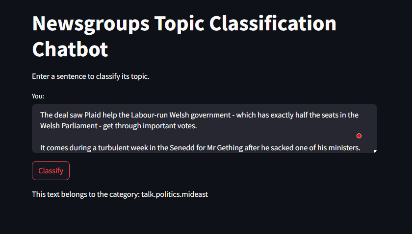

# Text-classification-chatbot-NLP

The Newsgroups Topic Classification Chatbot is a web-based application that classifies user-input text into one of the predefined categories from the 20 Newsgroups dataset. Utilizing a pre-trained Naive Bayes classifier and vectorizer, the chatbot processes the input text through a series of natural language processing steps, including tokenization, stopword removal, lemmatization, and stemming. Users can interact with the chatbot through a user-friendly interface provided by Streamlit, allowing them to easily classify the topic of any given sentence.

